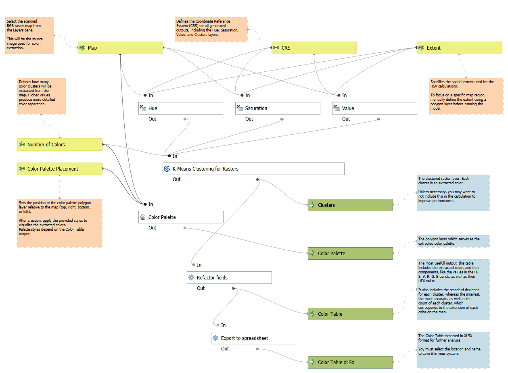

# 🌈 QGIS-Color-Extraction-Tool

A QGIS Processing Model that extracts **dominant colors** from scanned RGB raster maps using **HSV conversion** and **K-Means clustering**.  
The model generates clustered rasters, color palettes, and color tables (in HSV, RGB, and HEX formats).

---

## 🧠 Overview
**QGIS-Color-Extraction-Tool** converts an RGB raster into Hue, Saturation, and Value layers, then applies K-Means clustering to group similar colors.  
It’s designed for:
- Cartographers digitizing or analyzing historical or printed maps  
- Designers creating color palettes from map imagery  
- GIS analysts studying thematic color distributions  

---

## ⚙️ Workflow
1. **Input Selection** – Choose a scanned RGB map, CRS, extent, and number of colors.  
2. **RGB → HSV Conversion** – Creates three rasters: Hue, Saturation, and Value.  
3. **K-Means Clustering** – Groups pixels by color similarity.  
4. **Color Palette Creation** – Builds a color swatch grid next to your map.  
5. **Color Table Generation** – Computes HSV, RGB, and HEX values for each cluster.  
6. **Spreadsheet Export** – Saves the color table to `.xlsx` or `.ods`.

---

## 🧩 Inputs

| Parameter | Description |
|------------|-------------|
| **Map** | Select the scanned RGB raster map from the Layers panel. |
| **CRS** | Defines the coordinate system for all output layers. |
| **Extent** | Optionally limit the area used for analysis. |
| **Number of Colors** | Set the number of color clusters to extract. |
| **Color Palette Placement** | Choose where the color palette will appear (top, right, bottom, or left). |

---

## 📦 Outputs

| Output | Description |
|---------|-------------|
| **Clusters** | Raster layer representing the clustered color regions based on the extracted HSV values. |
| **Color Palette** | Polygon layer displaying the extracted colors as a palette positioned alongside the map. |
| **Color Table** | Attribute table containing detailed HSV, RGB, and HEX color information for each extracted cluster. |
| **Color Table XLSX** | Spreadsheet version of the Color Table, suitable for sharing or further analysis. |

---

## 🎨 Styles
Three QGIS style files (`.qml`) are provided in the `/styles/` folder:

| File | Description |
|------|--------------|
| `ColorPalette_Style1.qml` | Standard layout with labeled color swatches. |
| `ColorPalette_Style2.qml` | Minimalistic style emphasizing color contrast. |
| `ColorPalette_Style3.qml` | Grid layout optimized for map presentation. |

To apply a style:
1. In QGIS, right-click the **Color Palette** layer → **Properties → Symbology → Load Style…**  
2. Select one of the `.qml` files and click **Apply**.

---

## 🚀 How to Use
1. Open QGIS (3.34 or later).  
2. Go to **Processing Toolbox → Models → Add Model to Toolbox**.  
3. Browse to and select `RGB_to_HSV_Color_Clusters.py` (or `.model3` if included).  
4. Run the model with your parameters and output folder.  

You’ll get:
- A **clustered raster**  
- A **color palette layer**  
- A **color table** (in QGIS and Excel formats)

---

## 🧰 Requirements
- **QGIS 3.34+**  
- **SAGA GIS** (for K-Means clustering)  
- **GRASS GIS** (for palette grid creation)

---

## 📸 Example

---

## 🧑‍💻 Author
**[Your Name]**  
Developed for map color analysis and visualization in QGIS.

---

## 📄 License
Choose a license (e.g. MIT, GPL-3.0, or CC-BY-SA) and mention it here.

---

## 🔖 Citation
If you use this model in your research or project, please cite:
> *RGB to HSV Color Clusters – QGIS Color Extraction Tool, Version 4, 2025.*

---

